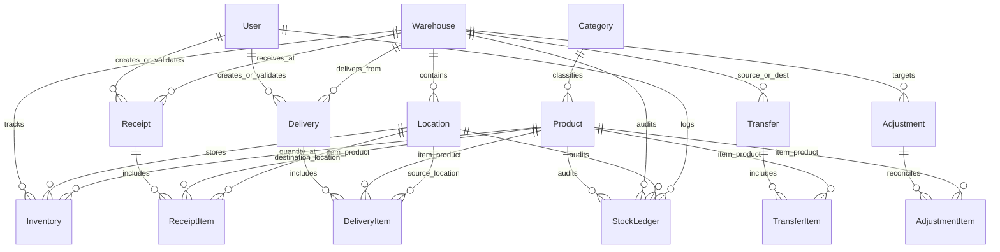

# StockSense Database Architecture & Data Dictionary

## 1. Overview

StockSense relies on a relational PostgreSQL database managed via Prisma ORM. The schema is normalized around physical warehouse topology, a strict product catalog, transactional documents, and an append-only audit ledger.

---

## 2. Entity Relationship Diagram (ERD Concept)

---

## 3. Data Dictionary

### 3.1 `User`
Stores authenticated system actors and roles.
- `id` (String, PK, CUID)
- `name` (String, required)
- `email` (String, unique, indexed)
- `passwordHash` (String, bcrypt hash)
- `role` (Enum: `ADMIN`, `INVENTORY_MANAGER`, `WAREHOUSE_STAFF`)
- `avatar` (String, nullable)
- `active` (Boolean, default `true`)
- `createdAt` / `updatedAt` (DateTime)

### 3.2 `Category`
Product classification taxonomy.
- `id` (String, PK, CUID)
- `name` (String, unique)
- `code` (String, unique, indexed)
- `description` (String, nullable)
- `active` (Boolean, default `true`)

### 3.3 `Product`
Master catalog items with unit of measure and reorder rules.
- `id` (String, PK, CUID)
- `name` (String, required)
- `sku` (String, unique, indexed)
- `description` (String, nullable)
- `categoryId` (String, FK -> `Category.id`)
- `uom` (String, default `"units"`)
- `reorderPoint` (Float, default `10`)
- `minStockLevel` (Float, default `5`)
- `maxStockLevel` (Float, nullable)
- `costPrice` (Decimal 12,2)
- `sellingPrice` (Decimal 12,2)
- `active` (Boolean, default `true`, indexed)

### 3.4 `Warehouse`
Physical or regional distribution facilities.
- `id` (String, PK, CUID)
- `name` (String, required)
- `code` (String, unique, indexed)
- `address`, `city`, `state`, `country` (String, nullable)
- `active` (Boolean, default `true`, indexed)

### 3.5 `Location`
Specific storage zones, racks, shelves, bins, or staging areas within a warehouse.
- `id` (String, PK, CUID)
- `warehouseId` (String, FK -> `Warehouse.id`, cascade delete)
- `name` (String, required)
- `code` (String, required)
- `type` (Enum: `RACK`, `SHELF`, `BIN`, `PALLET`, `FLOOR`, `INCOMING`, `OUTGOING`, `PRODUCTION`)
- `active` (Boolean, default `true`)
- **Unique Constraint:** `[warehouseId, code]`

### 3.6 `Inventory`
Current physical stock balance per product per location.
- `id` (String, PK, CUID)
- `productId` (String, FK -> `Product.id`, restrict delete)
- `locationId` (String, FK -> `Location.id`, restrict delete)
- `warehouseId` (String, FK -> `Warehouse.id`, restrict delete)
- `quantity` (Float, default `0`)
- `reservedQuantity` (Float, default `0`)
- **Unique Constraint:** `[productId, locationId]`

### 3.7 `Receipt` & `ReceiptItem`
Inbound goods receipts from vendors/suppliers.
- Statuses: `DRAFT`, `WAITING`, `READY`, `DONE`, `CANCELED`
- Items specify `expectedQuantity`, `receivedQuantity`, and target `locationId`.

### 3.8 `Delivery` & `DeliveryItem`
Outbound goods delivery to customers or production lines.
- Items specify `requestedQuantity`, `deliveredQuantity`, and source `locationId`.

### 3.9 `Transfer` & `TransferItem`
Intra-warehouse and inter-warehouse physical movements between a specific source and destination location.

### 3.10 `Adjustment` & `AdjustmentItem`
Reconciliation between recorded system quantity and physical count.
- Mandates a textual `reason` on the header.
- Records `systemQuantity`, `physicalQuantity`, and `differenceQuantity`.

### 3.11 `StockLedger` (Immutable Audit Trail)
Append-only log of every single stock change in the company.
- `id` (String, PK, CUID)
- `productId` (String, FK -> `Product.id`)
- `warehouseId` (String, FK -> `Warehouse.id`)
- `locationId` (String, FK -> `Location.id`)
- `transactionType` (Enum: `RECEIPT`, `DELIVERY`, `TRANSFER_IN`, `TRANSFER_OUT`, `ADJUSTMENT`)
- `quantityBefore` (Float)
- `quantityChange` (Float, positive or negative)
- `quantityAfter` (Float)
- `referenceType` (Enum: `RECEIPT`, `DELIVERY`, `TRANSFER`, `ADJUSTMENT`)
- `referenceId` (String)
- `referenceNumber` (String)
- `notes` (String, nullable)
- `createdById` (String, FK -> `User.id`)
- `createdAt` (DateTime, indexed)

---

## 4. Integrity and Transactional Rules

1. **Atomic Invariance:**
   No `inventory` row is updated without a simultaneous insert into `StockLedger`.
2. **Non-Negative Balance Assertion:**
   Before updating any `inventory.quantity`, the calculation `quantity + change >= 0` is enforced.
3. **No Row Deletions for Audited Entities:**
   Products with ledger history cannot be deleted (enforced via `onDelete: Restrict`).
4. **Idempotency:**
   Operation validation endpoints verify status equals `READY` or `DRAFT` before executing, preventing double execution. Once marked `DONE`, documents cannot be re-validated.
5. **Receipt Inward Atomicity:**
   Validating a receipt executes in a single interactive transaction that verifies line items and locations, increments `inventory.quantity`, appends an immutable `StockLedger` audit record, and locks the receipt as `DONE` with validator attribution.
6. **Delivery Outward Atomicity:**
   A validated delivery decreases `Inventory` and creates the corresponding `DELIVERY` `StockLedger` entries atomically.
7. **Negative Stock Prohibition:**
   `Inventory` quantity must never become negative (`newQuantity >= 0`).
8. **Delivery Immutability:**
   A completed `Delivery` (`status = DONE`) cannot be edited, modified, or canceled.
9. **Warehouse Boundary Constraint:**
   A `Delivery` can only consume inventory from locations belonging to its designated warehouse facility (`item.location.warehouseId === delivery.warehouseId`).
10. **Concurrency & Capacity Invariant:**
    The sum of successful delivery quantities must never exceed available stock. Concurrency is enforced via deterministic lock ordering and PostgreSQL row-level locks (`SELECT ... FOR UPDATE`).
11. **Transfer Atomicity & Balance Invariant:**
    A completed transfer atomically decreases source inventory and increases destination inventory within a single database transaction.
12. **Transfer Dual-Ledger Creation:**
    A transfer creates exactly one `TRANSFER_OUT` and one `TRANSFER_IN` ledger entry per transferred line, linked by `referenceType = TRANSFER` and `referenceId = transfer.id`.
13. **Zero Net Stock Invariant:**
    Total company stock is unchanged by a transfer ($\sum \text{Stock After} \equiv \sum \text{Stock Before}$).
14. **Source Inventory Non-Negative Rule:**
    Source inventory can never become negative ($\text{sourceQuantity} - \text{transferQuantity} \ge 0$).
15. **Warehouse/Location Topology Integrity:**
    Source location must belong to source warehouse, and destination location must belong to destination warehouse.
16. **Same Location Prohibition:**
    Source and destination cannot be the same location (`sourceLocationId !== destinationLocationId`).
17. **Transfer Immutability & Idempotency:**
    Completed transfers (`status = DONE`) are immutable, cannot be edited or canceled, and cannot be re-validated.

