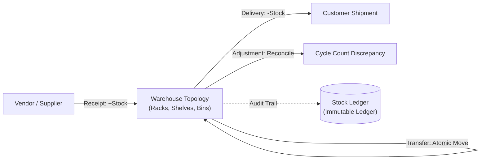

# StockSense — Application Walkthrough & User Guide

StockSense is a centralized, real-time Inventory Management System (IMS) designed to streamline supply chain workflows across warehouses, products, incoming receipts, outgoing deliveries, internal transfers, and physical stock adjustments.

---

## 🚀 1. Getting Started & Running the Application

### Prerequisites
* Node.js (v18+)
* PostgreSQL / Supabase Database (connected via `.env`)

### Start Development Server
```bash
# From the project root
npm run dev
```

Open your browser at **`http://localhost:3000`**.

---

## 🔐 2. Authentication & User Roles

| Screen | Route | Key Features |
| :--- | :--- | :--- |
| **Sign In** | `/login` | Matches mockup with **Login Id** & **Password** inputs, `SIGN IN` button, `Forget Password ? \| Sign Up` links, and exact `"Invalid Login Id or Password"` mismatch handling. |
| **Sign Up** | `/signup` | Matches mockup with **Enter Login Id** (6-12 chars, unique), **Enter Email Id** (unique in db), **Enter Password** (>8 chars with lowercase, uppercase, and special char), **Re-Enter Password** (matching check), and `SIGN UP` button. |
| **OTP Password Reset** | `/forgot-password` | Two-stage password recovery: Email verification ➔ 6-digit OTP entry ➔ Password reset confirmation. |

### Default Test Login Credentials:
* **Admin**: Login ID: `admin_user` (or `admin@stocksense.io`) / Password: `StockSense2026!`
* **Inventory Manager**: Login ID: `manager123` (or `manager@stocksense.io`) / Password: `StockSense2026!`
* **Warehouse Staff**: Login ID: `staff_123` (or `staff@stocksense.io`) / Password: `StockSense2026!`

---

## 📊 3. Operations Dashboard (`/dashboard`)

The landing page displays a real-time operational snapshot of your inventory:

### 📈 Documented KPIs
1. **Total Products in Stock**: Live count of active items with positive inventory balances.
2. **Low Stock / Out of Stock Items**: Alert counter tracking items at or below their reordering threshold (`reorderPoint`).
3. **Pending Receipts**: Active inbound vendor shipments awaiting validation (`DRAFT`, `WAITING`, `READY`).
4. **Pending Deliveries**: Outbound customer fulfillments awaiting pick, pack, and validation.
5. **Internal Transfers Scheduled**: In-transit internal stock movements between warehouses or racks.

### 🔍 Dynamic Filter Bar
Filter transactions and operational documents dynamically by:
* **Document Type**: *All Documents / Receipts / Deliveries / Internal Transfers / Adjustments*
* **Status**: *Draft / Waiting / Ready / Done / Canceled*
* **Warehouse & Storage Location**: Target specific facilities and racks/bins
* **Product Category**: Filter by Raw Materials, Finished Goods, Hardware, Electronics, etc.

---

## 📦 4. Product Management

```
Products (/products)
  ├── Master Product Catalog (SKU Search, Stock Status Badges, Price & UOM)
  ├── Create / Edit Product Form (Name, SKU, Category, UOM, Reordering Rules)
  ├── Product Categories (/products/categories)
  └── Product Details & Location Availability (/products/[id])
```

1. **Master Catalog (`/products`)**:
   * Search by SKU or product name.
   * Filter by Category and Stock Status (*In Stock*, *Low Stock*, *Out of Stock*).
   * **Reordering Rules**: Configure `reorderPoint`, `minStockLevel`, and `maxStockLevel` to automate low stock alerts.
2. **Stock Availability per Location (`/products/[id]`)**:
   * View live stock breakdowns across all warehouses, racks, and bin locations.
   * Inspect SKU-specific transaction ledger history.
3. **Product Categories (`/products/categories`)**:
   * Manage classification taxonomy, unique category codes, and active item counts.

---

## 🔄 5. Core Operational Workflows



---

### 1️⃣ Receipts (Incoming Goods) — `/operations/receipts`
* **Purpose**: Used when items arrive from vendors/suppliers.
* **Workflow**:
  1. Click **New Receipt** (`/operations/receipts/new`).
  2. Input Supplier Name, destination Warehouse, and line items (Product, Target Location, Expected & Received Quantities).
  3. Click **Validate Receipt** ➔ Physical stock increases automatically (`stock +X`), the status updates to `DONE`, and an immutable `RECEIPT` audit entry is appended to the Stock Ledger.

---

### 2️⃣ Delivery Orders (Outgoing Goods) — `/operations/deliveries`
* **Purpose**: Fulfill customer orders and outbound shipments while enforcing non-negative inventory invariants and concurrency safety.
* **Workflow**:
  1. Click **Create Delivery** (`/operations/deliveries/new`).
  2. Select Customer Name, fulfillment Warehouse, and products with their specific source storage locations.
  3. Real-time **Available Stock** and **Remaining Stock** preview calculations guide the user before submission.
  4. Move through picking and packing stages (`WAITING` ➔ `READY`).
  5. Click **Validate Delivery** ➔ A confirmation modal displays destructive stock warnings.
  6. Upon confirmation, the backend acquires PostgreSQL row-level locks (`SELECT ... FOR UPDATE`), verifies sufficient stock, atomically decrements physical stock (`stock -X`), updates the status to `DONE`, and posts an immutable `DELIVERY` audit record to the Stock Ledger.
  7. If any line fails or if concurrent operations consume available stock, the entire transaction safely rolls back with zero negative stock.

---

### 3️⃣ Internal Transfers — `/operations/transfers`
* **Purpose**: Move physical inventory between storage locations (intra-warehouse racks/bins or inter-warehouse logistics) with mathematical zero net stock change ($\sum \text{Before} \equiv \sum \text{After}$) and deterministic deadlock protection.
* **Workflow**:
  1. Click **Create Transfer** (`/operations/transfers/new`).
  2. Select **Source Warehouse & Location** and **Destination Warehouse & Location** (server and client enforce $Source \ne Destination$).
  3. Add line items: System provides live dual-sided stock previews (**Available**, **Transfer**, **Remaining Source**, **Current Dest**, **Dest After**).
  4. Save as `DRAFT` or progress through staging states (`WAITING` $\to$ `READY`).
  5. Click **Validate Transfer** ➔ Confirmation modal displays destructive dual-sided warnings and zero-net-stock invariant reminder.
  6. Upon confirmation, backend transaction deterministically locks all affected `(productId, locationId)` tuples using PostgreSQL `SELECT ... FOR UPDATE`, checks authoritative source balances, decreases source inventory, increases destination inventory, posts linked `TRANSFER_OUT` and `TRANSFER_IN` entries to `StockLedger`, and locks the transfer as `DONE`.
  7. If any line has insufficient stock or concurrent operations deplete stock, the entire transaction rolls back cleanly with zero balance change.


---

### 4️⃣ Stock Adjustments — `/operations/adjustments`
* **Purpose**: Reconcile mismatches between recorded system inventory and physical cycle counts or damaged goods.
* **Workflow**:
  1. Click **New Adjustment** (`/operations/adjustments/new`).
  2. Select Warehouse and Storage Location.
  3. Provide a **Mandatory Justification / Reason** (e.g., *"Q3 Annual physical cycle count discrepancy"*).
  4. Select product ➔ System auto-displays recorded system stock ➔ Enter counted physical quantity ➔ System calculates net difference.
  5. Click **Validate & Reconcile Stock** ➔ Stock is updated to the physical count, and differences (+/-) are posted with justification to the Stock Ledger.

---

## 📜 6. Move History / Stock Ledger (`/operations/ledger`)

An immutable, append-only ledger tracking all inventory transactions:
* **Timestamp & Product SKU**: Precise date and item code.
* **Facility & Storage Location**: Physical warehouse and bin/rack identifier.
* **Movement Type**: `RECEIPT`, `DELIVERY`, `TRANSFER_IN`, `TRANSFER_OUT`, `ADJUSTMENT`.
* **Reference Document**: Direct link to source document (`RCP-...`, `DEL-...`, `TRF-...`, `ADJ-...`).
* **Before, Change (+/-), and After**: Exact physical quantities.
* **Operator**: Identity of the staff member who validated the transaction.

---

## 🏢 7. Warehouses & System Settings

* **Warehouses (`/warehouses`)**: Manage multi-warehouse distribution centers, addresses, and overall capacity.
* **Locations (`/warehouses/[id]`)**: Configure storage topologies including Racks, Shelves, Bins, Pallets, Floor areas, and Staging zones.
* **Settings (`/settings`)**: Configure global reorder thresholds, minimum safety stocks, and inspect strict transactional ledger policies.

---

## 👤 8. User Profile Menu (`/profile`)

* Accessible from the left sidebar and mobile navigation drawer.
* View and edit operator name, view role permissions (*Inventory Manager* vs *Warehouse Staff*), and securely sign out.

---

## 🧪 9. Verification & Code Quality

* **Type Safety**: `npx tsc --noEmit` ➔ 0 errors.
* **Test Suite**: `npm test` (Vitest) ➔ 57/57 unit/integration tests passing across 4 test suites.
* **Production Build**: `npm run build` ➔ All 38 static and dynamic Next.js routes compiled cleanly.
